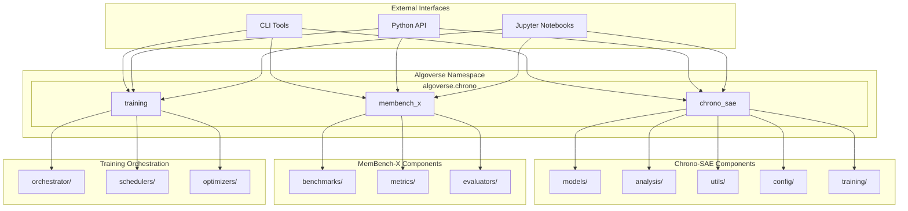
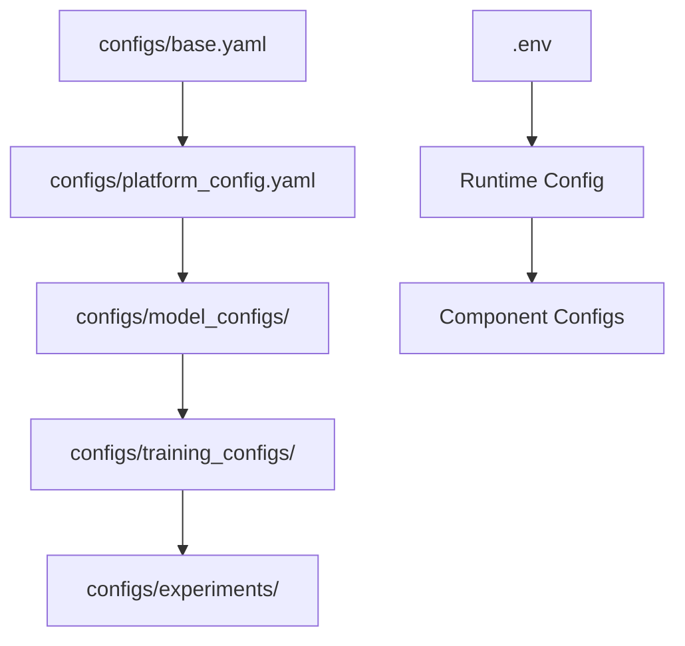
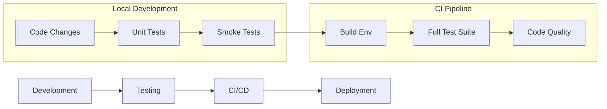

# Chrono-MemBench Architecture

## Overview

Chrono-MemBench is a comprehensive framework for tracking and steering memory features in Large Language Models (LLMs). The project is organized under the `algoverse.chrono` namespace, providing a clean separation of concerns across three main components.

## Directory Structure

```
chrono-membench/
├── src/algoverse/chrono/          # Main namespace package
│   ├── chrono_sae/                # Sparse Autoencoder components
│   ├── membench_x/                # Memory benchmarking tools  
│   └── training/                  # Training orchestration
├── tests/                         # Test suites
│   ├── smoke/                     # Basic functionality tests
│   ├── unit/                      # Component unit tests
│   └── integration/               # End-to-end tests
├── notebooks/                     # Research and analysis notebooks
├── scripts/                       # Utility and automation scripts
├── configs/                       # Configuration files
├── docs/                          # Documentation
└── legacy/                        # Deprecated code and notebooks
```

## Component Architecture



## Module Descriptions

### 1. `algoverse.chrono.chrono_sae`

The Sparse Autoencoder (SAE) component for memory feature extraction and steering.

**Submodules:**
- `models/`: SAE architectures and model definitions
- `training/`: SAE-specific training loops and optimization
- `analysis/`: Memory feature analysis and interpretation
- `utils/`: Utility functions for SAE operations
- `config/`: Configuration management for SAE

**Key Features:**
- Temporal dropout mechanisms
- Route-SAE integration
- Memory feature steering
- Activation pattern analysis

### 2. `algoverse.chrono.membench_x`

Comprehensive memory benchmarking and evaluation framework.

**Submodules:**
- `benchmarks/`: Memory-related benchmark tasks
- `metrics/`: Evaluation metrics for memory capabilities
- `evaluators/`: Automated evaluation pipelines

**Key Features:**
- Memory recall benchmarks
- Temporal reasoning tasks
- Context length evaluation
- Memory interference analysis

### 3. `algoverse.chrono.training`

High-level training orchestration for coordinated SAE and benchmark training.

**Submodules:**
- `orchestrator/`: Multi-component training coordination
- `schedulers/`: Learning rate and training schedulers
- `optimizers/`: Custom optimization strategies

**Key Features:**
- Multi-stage training pipelines
- Resource management across components
- Experiment tracking and logging
- Platform-specific optimizations

## Configuration Management

The project uses a hierarchical configuration system:



## Testing Strategy

The testing framework is organized into three tiers:

1. **Smoke Tests** (`tests/smoke/`): Basic functionality and import validation
2. **Unit Tests** (`tests/unit/`): Component-level testing with mocking
3. **Integration Tests** (`tests/integration/`): End-to-end workflow testing

## Development Workflow



## Environment Management

The project supports multiple deployment environments:

- **Development**: macOS with MPS acceleration
- **Training**: Windows/Linux with CUDA GPU support
- **CI/CD**: Linux CPU for automated testing

Each environment is managed through conda with automatic detection and setup via `scripts/bootstrap_env.py`.

## Future Extensions

The namespace architecture supports future extensions:

- `algoverse.chrono.interpretability`: Model interpretability tools
- `algoverse.chrono.datasets`: Custom dataset management
- `algoverse.chrono.visualization`: Analysis and result visualization
- `algoverse.chrono.deployment`: Model deployment utilities

## Getting Started

1. **Environment Setup**:
   ```bash
   python scripts/bootstrap_env.py
   conda activate chrono_membench_cpu  # or chrono_membench_gpu
   pip install -e .
   ```

2. **Run Tests**:
   ```bash
   pytest tests/smoke/  # Basic functionality
   pytest tests/unit/   # Component tests
   pytest tests/        # Full test suite
   ```

3. **Import Components**:
   ```python
   from algoverse.chrono.chrono_sae import models
   from algoverse.chrono.membench_x import benchmarks
   from algoverse.chrono.training import orchestrator
   ```

## Dependencies

- **Core**: PyTorch 2.5+, Transformers 4.40+, Datasets 2.15+
- **Development**: pytest, black, isort, pre-commit
- **Platform**: CUDA 12.1+ (GPU), MPS (macOS), CPU fallback
- **Optional**: flash-attention, triton (GPU only)

---

*This architecture is designed to be modular, extensible, and maintainable while supporting the complex requirements of memory analysis in large language models.*
